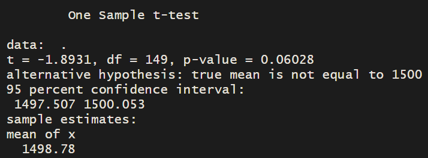
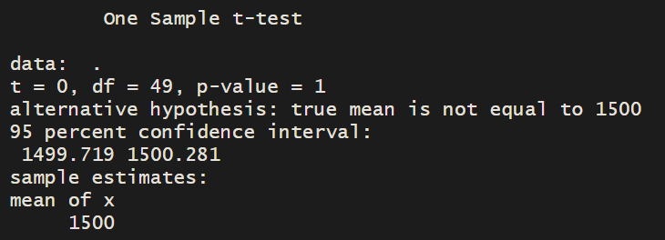
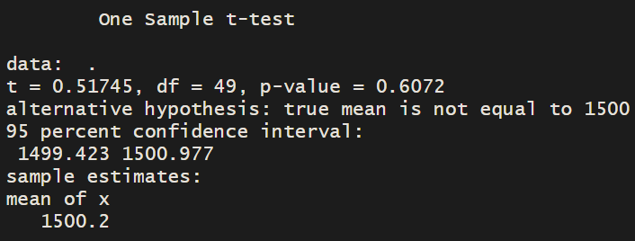
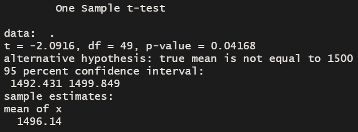

# MechaCar_Statistical_Analysis

## Linear Regression to Predict MPG

The slope shouldn't be considered to be zero, because p-value is only 5.35e-11, which is much less than than usual threshold 0.05.

Given tiny p-values of vehicle_length and ground_clearance, these variables have a significant impact on MPG. Intercept is small, so it seems all significant variables have been included in the model.

R-squared is more than 0.7, which means our model approximates the data well.

The fact there are only two significant variables may mean that our model overfits the data. So we should split tha data in two datasets and try to forecast second dataset with coefficients received with the first dataset. See my proposal in the last section.

### Summary

The model approximates data well but it probably overfits tha data

## Summary Statistics on Suspension Coils

The variance of the suspension coils for all lots in total seems large but it meets the design specification: it does not exceed 100 pounds per square inch.

When we have looked into individual lots it turned out, that Lot1 is ideal, Lot2 is good, and Lot3 is bad and should be recalled.

## T-Tests on Suspension Coils

PSI across all lots may be called statistically different from the population mean 1500 as p-value is less than 0.05.

PSI for lot1 *is not* statistically different from the population mean 1500 as p-value is maximum.

PSI for lot2 is not statistically different from the population mean 1500  as p-value is large.

PSI for lot3 is definitely statistically different from the population mean 1500  as p-value is less than 0.05.

